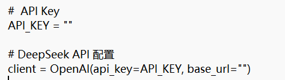
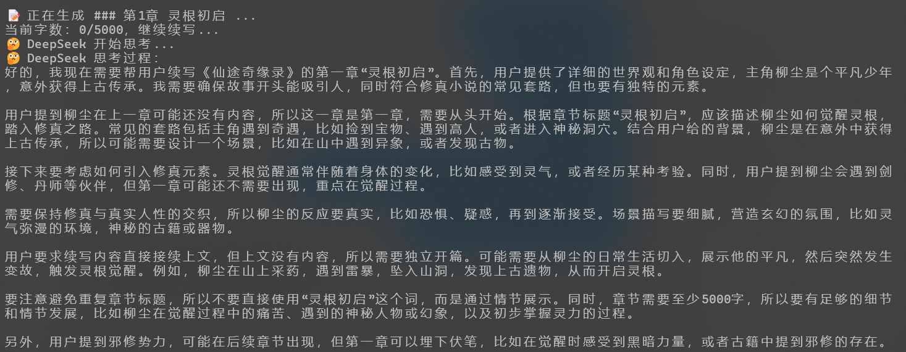
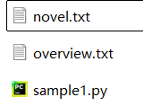

# ATwrite

## 使用大模型API自动生成百万字小说！😍

## 介绍

脚本适用于openai SDK

由于大部分大模型的API没有记忆功能，脚本采用以下方式来确保行文把握主题，不出现前后矛盾：

- 让AI在脚本里写很详细的小说背景设定，每次对话都告诉它这个背景设定。
- 生成一个文件overview.txt，每次调用api，生成100字的概要，写进这个文件。
- 每次对话选取小说最后5000字作为上下文参考

在每次调用api进行续写的时候会提供背景设定+最后5000字+overview.txt中的**所有内容**

使用时请确认所用的API支持的输入长度，可以适当调节小说字数和摘要长度。

## 安装环境

1. 安装python：https://www.python.org/downloads/

2. 安装openai库: 
   ```powershell
   pip install openai
   ```

## 使用步骤

参考prompt.txt中的提示词，可以在网页端让AI帮你修改示例脚本sample.py，改成你需要写的小说。

新建一个py文件，例如`sample1.py`，将修改好的脚本复制进去，并在对应位置填入APIkey和base url



在`sample1.py`的同级目录打开命令行执行` python sample1.py` 即可



顺利的话，脚本会在同级目录下新建两个文件，其中novel.txt就是小说主体


